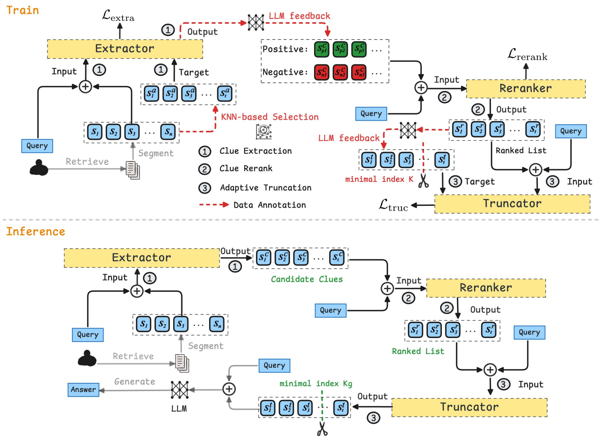

# FineFilter
This is the repository for the paper: **FineFilter: A Fine-grained Noise Filtering Mechanism for Retrieval-Augmented Large Language Models.** 

You can find our preprocessed datasets at [(here)](https://drive.google.com/drive/folders/1IIJDJaanS3WnB1LjTQke1_F7dEsw9v_B?usp=sharing)

# Model Architecture

